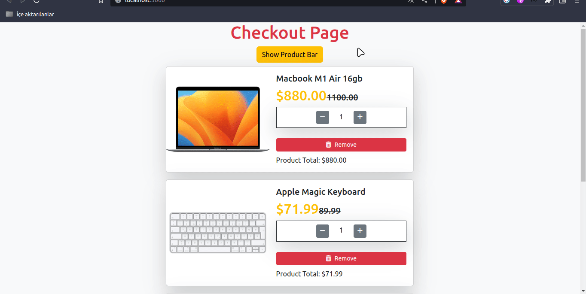

[👉 click here to view the page](https://msaiduslu.github.io/checkout-page-react/)

# Project : Checkout Page

## Description

Project aims to create a Checkout Page App.

## Project Skeleton

```
Checkout Page (folder)
|
|----readme.md
├── public
│     └── index.html
├── src
│   ├── App.css
│   ├── App.js
│   ├── components
│   │   ├── AddProduct.jsx
│   │   ├── Button.jsx
│   │   ├── CardTotal.jsx
│   │   ├── Header.jsx
│   │   └── ProductCard.jsx
│   ├── helper
│   │   └── data.js
│   ├── index.css
│   ├── index.js
│
├── package.json
└── yarn.lock

```

### At the end of the project, following topics are to be covered;

- Props and State Logic

- React Hooks

- React Props

- 3rd Part Libraries

- Axios

- Data Fetching

### At the end of the project, students will be able to;

- improve coding skills within HTML & CSS & JS & ReactJS.

- use git commands (push, pull, commit, add etc.) and Github as Version Control System.
